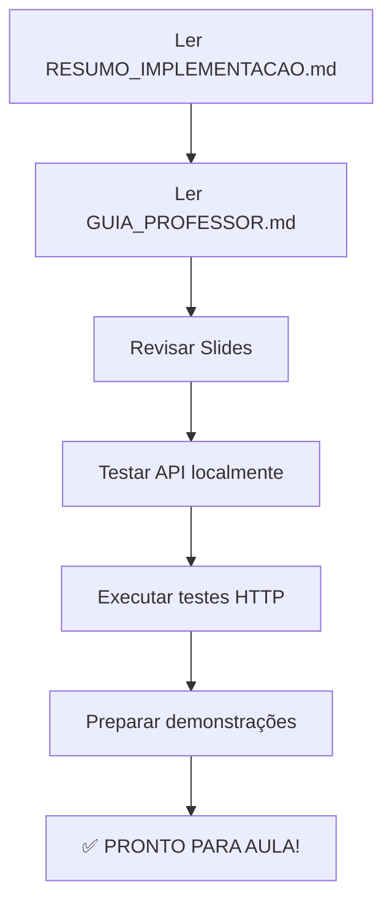
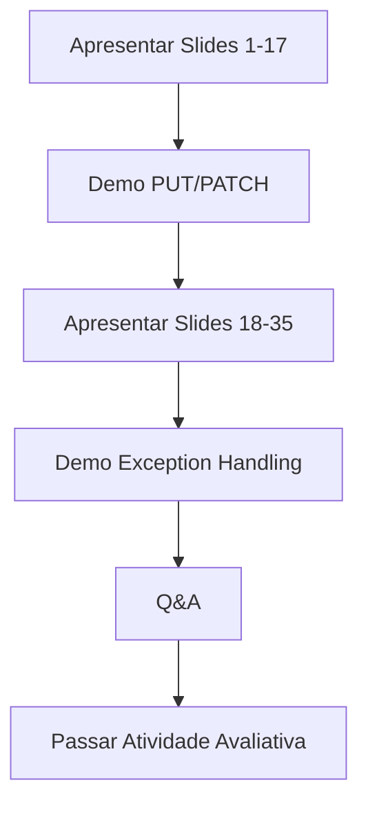
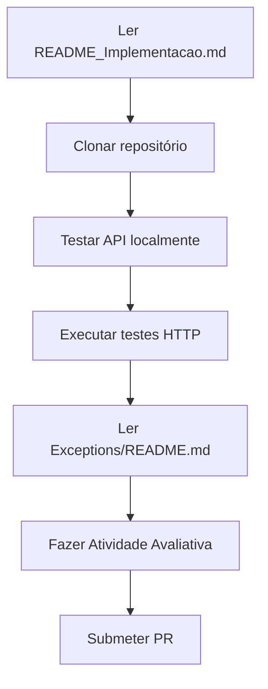

# 📚 ÍNDICE GERAL - Documentação da Aula

## 🎯 Para o Professor

### 1. **COMEÇAR AQUI** 🌟
- **[RESUMO_IMPLEMENTACAO.md](RESUMO_IMPLEMENTACAO.md)**
  - Visão geral de TUDO que foi implementado
  - Checklist pré-aula
  - Métricas de sucesso
  - **⏱️ Leitura: 5 minutos**

### 2. **ROTEIRO DA AULA** 📋
- **[GUIA_PROFESSOR.md](GUIA_PROFESSOR.md)**
  - Timing detalhado (2-3 horas)
  - Demonstrações ao vivo
  - Frases de efeito
  - Perguntas esperadas dos alunos
  - Soluções de problemas comuns
  - **⏱️ Leitura: 10 minutos**
  - **💡 ESSENCIAL antes da aula!**

### 3. **SLIDES DA AULA** 📊
- **[Aula_PUT_PATCH_ExceptionHandling.md](Aula_PUT_PATCH_ExceptionHandling.md)**
  - 40 slides prontos para apresentar
  - Parte 1: PUT vs PATCH (slides 1-17)
  - Parte 2: Exception Handling (slides 18-40)
  - Teoria + exemplos práticos
  - Exercícios para alunos
  - **⏱️ Apresentação: 60-90 minutos**

### 4. **COMPARAÇÃO VISUAL** 🎨
- **[COMPARACAO_VISUAL_PUT_PATCH.md](COMPARACAO_VISUAL_PUT_PATCH.md)**
  - Material visual para projetar
  - Comparação lado a lado
  - Exemplos práticos
  - Exercícios interativos
  - **💡 Ótimo para imprimir/compartilhar**

---

## 👨‍🎓 Para os Alunos

### 1. **GUIA DE IMPLEMENTAÇÃO** 📖
- **[README_Implementacao.md](README_Implementacao.md)**
  - O que foi implementado
  - Como testar
  - Estrutura de arquivos
  - Conceitos explicados
  - **⏱️ Leitura: 15 minutos**
  - **💡 Compartilhar após a aula**

### 2. **DOCUMENTAÇÃO DE EXCEÇÕES** 🛡️
- **[../Application/Exceptions/README.md](../Application/Exceptions/README.md)**
  - Explicação de cada exceção customizada
  - Quando usar cada uma
  - Exemplos de código
  - Boas práticas
  - **⏱️ Leitura: 10 minutos**

### 3. **ATIVIDADE AVALIATIVA** 📝
- **[ATIVIDADE_AVALIATIVA.md](ATIVIDADE_AVALIATIVA.md)**
  - Questões teóricas (2,0 pontos)
  - Implementação prática (6,0 pontos)
  - Testes (2,0 pontos)
  - Bônus (até +2,0)
  - Rubrica de avaliação
  - **💡 Passar no final da aula**

---

## 🧪 Arquivos de Teste

### 1. **TESTES COMPLETOS** 🔬
- **[../APIProdutos_Completo.http](../APIProdutos_Completo.http)**
  - 38 cenários de teste organizados
  - PUT, PATCH, exceções
  - Idempotência, edge cases
  - **💡 Usar na demonstração ao vivo**

---

## 📁 Estrutura de Pastas Criadas

```
docs/
├── INDICE.md                              ← VOCÊ ESTÁ AQUI
├── RESUMO_IMPLEMENTACAO.md               ← Começar aqui (professor)
├── GUIA_PROFESSOR.md                     ← Roteiro da aula
├── Aula_PUT_PATCH_ExceptionHandling.md   ← Slides (40)
├── COMPARACAO_VISUAL_PUT_PATCH.md        ← Material visual
├── README_Implementacao.md               ← Para alunos
└── ATIVIDADE_AVALIATIVA.md               ← Exercícios

Application/
├── DTOs/
│   ├── ProdutoUpdateDto.cs               ← PUT (campos obrigatórios)
│   └── ProdutoPatchDto.cs                ← PATCH (campos opcionais)
├── Exceptions/
│   ├── README.md                         ← Documentação de exceções
│   ├── BusinessException.cs              ← Base abstrata
│   ├── NotFoundException.cs              ← 404
│   ├── ValidationException.cs            ← 400
│   └── DuplicateException.cs             ← 409
├── Interfaces/
│   ├── IProdutoService.cs                ← +AtualizarAsync, +AtualizarParcialAsync
│   └── IProdutoRepository.cs             ← +UpdateAsync
└── Services/
    └── ProdutoService.cs                 ← Métodos PUT/PATCH implementados

Infrastructure/
└── Repositories/
    └── ProdutoRepository.cs              ← UpdateAsync implementado

Middleware/
└── GlobalExceptionHandlerMiddleware.cs   ← Tratamento centralizado de erros

APIProdutos_Completo.http                 ← 38 testes prontos
Program.cs                                ← Endpoints PUT/PATCH + middleware
```

---

## 🎯 Fluxo de Uso Recomendado

### ANTES DA AULA (Professor):



**Tempo estimado:** 30-45 minutos

---

### DURANTE A AULA (Professor):



**Duração:** 2-3 horas

---

### DEPOIS DA AULA (Alunos):



**Tempo estimado:** 4-6 horas

---

## 📊 Mapa Mental dos Conceitos

```
                    AULA DE HOJE
                         │
        ┌────────────────┴─────────────────┐
        │                                  │
   PUT vs PATCH              EXCEPTION HANDLING
        │                                  │
        ├─ Substituição Total         ├─ Middleware Global
        ├─ Atualização Parcial        ├─ Exceções Customizadas
        ├─ Idempotência               ├─ Problem Details (RFC 7807)
        ├─ DTOs Diferentes            ├─ Logging Estruturado
        └─ Validações                 └─ 4xx vs 5xx
```

---

## 🎓 Objetivos de Aprendizagem por Documento

| Documento | Objetivo | Público | Tempo |
|-----------|----------|---------|-------|
| RESUMO_IMPLEMENTACAO | Visão geral completa | Professor | 5 min |
| GUIA_PROFESSOR | Roteiro detalhado aula | Professor | 10 min |
| Aula_PUT_PATCH... | Slides de apresentação | Ambos | 90 min |
| COMPARACAO_VISUAL | Material de apoio visual | Alunos | 15 min |
| README_Implementacao | Guia técnico completo | Alunos | 20 min |
| Exceptions/README | Entender exceções | Alunos | 10 min |
| ATIVIDADE_AVALIATIVA | Fixar aprendizado | Alunos | 4-6h |

---

## 🔗 Links Rápidos

### Referências Externas:
- [RFC 7231 - HTTP PUT](https://datatracker.ietf.org/doc/html/rfc7231#section-4.3.4)
- [RFC 5789 - HTTP PATCH](https://datatracker.ietf.org/doc/html/rfc5789)
- [RFC 7807 - Problem Details](https://datatracker.ietf.org/doc/html/rfc7807)
- [ASP.NET Core Error Handling](https://learn.microsoft.com/en-us/aspnet/core/fundamentals/error-handling)
- [ASP.NET Core Middleware](https://learn.microsoft.com/en-us/aspnet/core/fundamentals/middleware/)

### Código-Fonte:
- [Program.cs](../Program.cs) - Endpoints
- [ProdutoService.cs](../Application/Services/ProdutoService.cs) - Lógica
- [GlobalExceptionHandlerMiddleware.cs](../Middleware/GlobalExceptionHandlerMiddleware.cs) - Tratamento de erros

---

## 📞 Suporte

### Para o Professor:
- Dúvidas sobre material: Revisar `GUIA_PROFESSOR.md`
- Problemas técnicos: Verificar `RESUMO_IMPLEMENTACAO.md` → Checklist
- Ideias de melhorias: Bem-vindas!

### Para os Alunos:
- **Dúvidas técnicas:** Criar Issue no GitHub
- **Problemas de ambiente:** Office Hours (Terças 14h-16h)
- **Esclarecimentos da atividade:** Email ou Issue

---

## ✅ Checklist de Documentação

- [x] Slides completos (40 slides)
- [x] Roteiro para professor
- [x] Guia para alunos
- [x] Documentação de código
- [x] Testes prontos (38 cenários)
- [x] Atividade avaliativa
- [x] Material visual
- [x] Resumo executivo
- [x] Este índice

**Status:** ✅ **100% Completo**

---

## 🎉 Resumo Final

### O que temos:
✅ **1200+ linhas** de código implementado  
✅ **2500+ linhas** de documentação  
✅ **40 slides** de aula  
✅ **38 testes** automatizados  
✅ **7 documentos** de apoio  
✅ **1 atividade** avaliativa completa  

### Tempo de preparação:
- ⏱️ **Professor:** 30-45 minutos de leitura
- ⏱️ **Aula:** 2-3 horas
- ⏱️ **Alunos:** 4-6 horas de prática

### Resultado esperado:
🎯 Alunos capazes de implementar APIs RESTful profissionais com tratamento adequado de erros!

---

## 🚀 Próximos Passos

Após esta aula, considere:
1. **Aula 3:** FluentValidation
2. **Aula 4:** Testes Unitários (xUnit + Moq)
3. **Aula 5:** Logging Avançado (Serilog)
4. **Aula 6:** Paginação e Filtros
5. **Aula 7:** Autenticação JWT

Material para essas aulas pode seguir o mesmo padrão de qualidade!

---

**Preparado com ❤️ por:** Copilot + Prof. Lucas Fogaça  
**Data:** 04 de Novembro de 2025  
**Versão:** 1.0  
**Status:** Pronto para uso em sala de aula! 🎓

---

**BOA AULA! 🚀**
